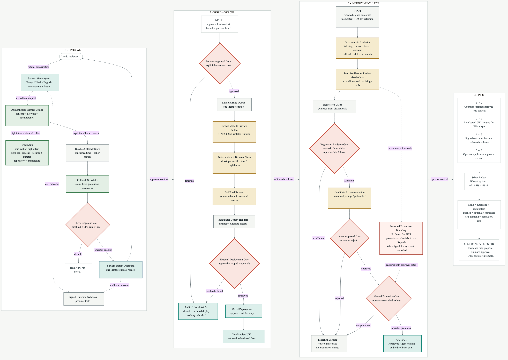

# ElevateBox Voice Agent Bridge

This is the action layer for Srikar Reddy's ElevateBox SDE Intern assignment. Sarvam handles the live Telugu, Hindi, English, and code-mixed voice conversation. This bridge validates and sends mid-call WhatsApp actions, books spoken callback times, dispatches due callbacks through Sarvam Instant Outbound, delivers the complete post-call package, and evaluates transcripts through a governed feedback loop.

## What works

- Two-number allowlist: assignment reviewer and controlled test number
- Idempotent mid-call and automatic post-call WhatsApp delivery
- Sarvam-specific action routes with server-generated idempotency keys
- Post-call context, mobile number, architecture image, resume, repository, and note
- Confirmed callback booking with durable state and live Sarvam dispatch
- Hot, Warm, and Cold intent evidence from structured agent variables
- Deterministic evaluation plus isolated, tool-free Hermes scoring
- Human-approved recommendations; feedback cannot edit prompts or place calls

## Run locally

```bash
npm ci
cp deploy/elevate-whatsapp-bridge.env.example .env
npm test
npm run test:integration
npm run check
```

Load the environment values through your process manager, then run `npm start`. The service listens on loopback by default. See [docs/demo-runbook.md](docs/demo-runbook.md) for callback states, live-call gates, recovery, and assignment coverage.

Sarvam's HTTP tools use `POST /v1/sarvam/tools/messages` and `POST /v1/sarvam/tools/callbacks` with the bridge bearer credential. These routes derive stable request IDs from their validated payloads so the voice model never has to generate operational identifiers.

## Architecture



## Implementation note

What works: Sarvam calls, listens across Telugu, Hindi and English, qualifies the lead, and triggers authenticated Hermes actions during the conversation. Hot intent sends contextual WhatsApp before hang-up; confirmed callback times are stored durably; the final follow-up carries actual call context, my number, the architecture image, resume, and repository. Current limitation: WhatsApp uses a linked personal session for this experiment, so reconnection may occasionally be required. Next: replace that transport with Meta Cloud API and connect callbacks to production CRM and campaign orchestration.

Contact: `+91 86398 85985`
