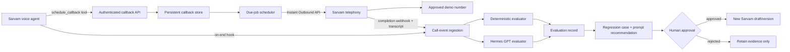

# Callback Execution and Voice-Agent Feedback Loop

**Status:** Approved design
**Date:** 2026-08-23
**System:** ElevateBox Sarvam voice-agent demo on the Srikar Hermes VPS

## Context

The deployed bridge currently accepts callback bookings and stores them in
`callbacks.json`, but it does not execute due bookings. The only persisted
booking is a deployment check explicitly marked "do not place a call". No
Sarvam outbound credentials are configured in the service, and no worker calls
`PersistentCallbackStore.listDue()`.

This explains the missed five-minute callback: the agent could verbally promise
a callback, but the backend had neither a real booking from that conversation
nor a dispatcher capable of placing it.

The system also has no feedback pipeline. Sarvam retains call logs, but the VPS
does not ingest transcripts, score behavior, create regression cases, or prepare
reviewable prompt improvements.

## Goals

1. Execute confirmed callbacks through Sarvam Instant Outbound at the requested
   time.
2. Restrict every automatic callback to these two demo destinations:
   - `+918639885985`
   - `+918688664337`
3. Persist callback and outbound-attempt state across process and VPS restarts.
4. Prevent duplicate calls when delivery state is uncertain.
5. Ingest Sarvam result webhooks and their interaction transcripts.
6. Score calls for reliability and conversational quality.
7. Convert failures into regression cases and proposed prompt corrections.
8. Require human approval before a recommendation changes the Sarvam agent.

## Non-Goals

- Calling numbers outside the two-number allowlist.
- Automatically retrying `busy` or `no_answer` recipients.
- Training or fine-tuning model weights.
- Automatically deploying or publishing a Sarvam agent version.
- Replacing Sarvam telephony, ASR, TTS, or its real-time agent harness.
- Retrospectively placing the missed callback from 2026-08-22.

## Chosen Architecture

Extend the existing Node.js bridge rather than creating a second service. This
keeps authentication, rate limiting, durable state, systemd hardening, and the
existing Sarvam tools in one operational boundary.



Sarvam's supported Instant Outbound API is the call transport. A request names
the organisation, workspace, agent and committed version, telephony connection,
agent phone number, destination, and completion webhook. Sarvam returns an
`attempt_id`. Its completion webhook includes `status`, `interaction_id`, final
agent variables, failure details, and the translated interaction transcript.

## Callback Contract

### Booking endpoint

`POST /v1/callbacks` remains authenticated with the existing bridge bearer
secret. The request schema is extended with:

- `confirmed_by_user: true`
- `confirmed_at`: ISO 8601 timestamp
- `source_interaction_id`: Sarvam interaction identifier when available

The existing fields remain: request ID, destination, callback timestamps,
timezone, prospect name, and context summary.

Validation rules:

- Normalize the destination to digits before comparing it to the allowlist.
- Reject every destination outside the two approved demo numbers.
- Require `Asia/Kolkata` and an offset-bearing ISO timestamp.
- Require the callback to be at least 15 seconds in the future and no more than
  seven days ahead.
- Require the tool to declare that the caller explicitly confirmed the time.
- Preserve request-id idempotency. Repeated requests return the same booking.

The API returns success only after the booking is durably persisted. The agent
may say the callback is booked only after receiving that successful response.
The dispatcher reads the committed agent version from server configuration and
records it as `dispatched_agent_version`; the calling agent cannot choose or
override the version through tool arguments.

### State machine

Callback records use these states:

```text
scheduled -> dispatching -> dialing -> connected
                         -> no_answer
                         -> busy
                         -> failed
                         -> dispatch_unknown
scheduled -> expired
```

Every transition records a timestamp and a short machine-readable reason.

### Scheduler behavior

- Poll once per second inside the existing service.
- Persist `dispatching` before contacting Sarvam.
- Dispatch jobs within 15 seconds of their requested time under normal load.
- If the service restarts, dispatch an overdue `scheduled` job only when it is
  at most ten minutes late. Older jobs become `expired`.
- Do not automatically redial after `busy`, `no_answer`, or provider failure.
- Do not recover an interrupted `dispatching` job by calling again. Mark it
  `dispatch_unknown` for manual reconciliation, because Sarvam's endpoint does
  not document an idempotency key and a repeated request could double-call.

## Sarvam Outbound Adapter

Create a small adapter around:

```text
POST https://apps.sarvam.ai/api/outbounds/v1/orgs/{org_id}/workspaces/{workspace_id}/outbounds
```

Configuration comes only from the VPS environment:

- `SARVAM_API_KEY`
- `SARVAM_ORG_ID`
- `SARVAM_WORKSPACE_ID`
- `SARVAM_APP_ID`
- `SARVAM_APP_VERSION`
- `SARVAM_CONNECTION_ID`
- `SARVAM_AGENT_PHONE_NUMBER`
- `SARVAM_WEBHOOK_BASE_URL`
- `SARVAM_WEBHOOK_TOKEN`
- `CALLBACK_DISPATCH_MODE=disabled|dry_run|live`

`disabled` is the secure default. `dry_run` performs validation and records the
would-be payload without sending it. `live` is enabled only after the no-call
verification passes and a controlled test call is separately approved.

The webhook URL contains a high-entropy token. The echoed webhook metadata
contains the booking ID and request ID so results can be correlated without
placing phone numbers or secrets in the URL.

## Call-Event Ingestion

Add:

```text
POST /v1/sarvam/outbound-events/{token}
POST /v1/sarvam/on-end/{token}
```

The instant-outbound endpoint accepts Sarvam's completion webhook. The on-end
endpoint covers campaign and test-agent calls that did not originate in the
local scheduler. Both endpoints:

- validate a strict payload schema and body-size limit;
- use an unguessable URL token because Sarvam's webhook configuration does not
  expose a request-signing mechanism;
- deduplicate by `attempt_id` or `interaction_id`;
- correlate known bookings through echoed metadata;
- persist the event before returning HTTP 200;
- never log complete phone numbers, transcripts, API keys, or webhook tokens.

If a completion webhook lacks a transcript but supplies an `interaction_id`, a
backfill job uses Sarvam's Analytics Transcript API. Backfill is bounded and
idempotent; it never blocks the webhook response.

## Feedback Evaluation

### Inputs

- Interaction transcript (`agent` and `user` turns).
- Call status, duration, failure reason, and final agent variables.
- Callback booking and delivery state.
- Explicit operator feedback submitted to authenticated
  `POST /v1/feedback`.
- Agent version, allowing comparisons across versions.

No recording audio is retained by this subsystem. Phone numbers are stored as a
salted hash plus last four digits. Transcript retention is 30 days for this demo.

### Deterministic evaluator

Run deterministic checks first so reliability does not depend on an LLM:

- maximum words in each agent turn;
- more than one question in a turn;
- consecutive agent turns without a meaningful user response;
- repeated acknowledgements or repeated sentences;
- agent-to-user word ratio;
- callback requested versus booking created;
- booking due versus outbound attempt created;
- tool promise versus tool success;
- missing or contradictory extracted variables.

Interruption quality is marked `not_scoreable` when the available transcript has
no timing or overlap information. The evaluator must not invent a score for data
it cannot observe.

### Hermes evaluator

Hermes GPT-5.6 Sol receives the transcript, deterministic findings, and a fixed
rubric. It returns strict JSON containing:

- scores from 0 to 100 for listening, concision, naturalness, intent accuracy,
  and task completion;
- evidence as turn indexes, not invented quotations;
- classified failures;
- a minimal prompt-change recommendation;
- confidence and `insufficient_evidence` flags.

The HTTP and callback-dispatch process never shells out to Hermes. It writes a
bounded evaluation job to persistent storage. A separate, unprivileged
`elevate-feedback-worker` consumes the queue and invokes Hermes in one-shot,
tool-free mode with a strict timeout and output-size limit. The worker has its
own Hermes profile; it does not read root's Hermes credentials or run commands
supplied by transcripts. Its model and provider are pinned through
`HERMES_EVAL_MODEL=gpt-5.6-sol` and
`HERMES_EVAL_PROVIDER=openai-codex`.

If Hermes is unavailable, the event remains evaluated deterministically with
`llm_status: pending`. This never blocks callback delivery or webhook handling.

### Learning and promotion

A call becomes a regression case when any of these are true:

- callback or tool-delivery reliability fails;
- an operator reports a problem;
- deterministic score is below 85;
- Hermes score is below 85 with adequate evidence.

The system groups repeated failures by category and creates a candidate report
containing evidence, affected versions, a proposed prompt delta, and regression
expectations. A single critical reliability incident can create a candidate;
ordinary style changes require at least two calls showing the same pattern.

The system never modifies the live Sarvam agent. An operator must approve the
candidate, apply it to a Sarvam draft, run the regression fixtures, commit a new
version, and record the resulting version number in the candidate. Rejected
candidates remain as evidence but cannot be promoted.

This is a controlled feedback loop: it learns by expanding the evaluation set
and preparing evidence-backed improvements, not by silently changing production
behavior.

## Persistence

For the two-number demo, use the existing atomic JSON-store pattern rather than
introducing a database dependency:

- `callbacks.json`
- `outbound-events.json`
- `feedback.json`
- `evaluation-cases.json`
- `recommendations.json`

Every store uses write-to-temporary-file plus atomic rename, restrictive `0600`
permissions, bounded record counts, and deterministic identifiers. Stores are
opened before the HTTP listener starts so corrupt state fails closed.

## Security and Consent

- The callback allowlist is compiled into the request schema and also configured
  in the dispatcher. Both layers must agree before a call is placed.
- A confirmed callback request is consent for one call at one specific time; it
  is not consent for retries or later campaigns.
- API credentials remain in `/etc/elevate-whatsapp-bridge.env`, owned by root,
  and are never committed.
- Sarvam tool requests continue using bearer authentication.
- Webhook endpoints use separate high-entropy tokens and strict schemas.
- Logs contain booking/attempt IDs, statuses, and last-four phone digits only.
- `CALLBACK_DISPATCH_MODE` defaults to `disabled` after every fresh installation.

## Observability

`GET /health` is extended with non-sensitive component status:

```json
{
  "ok": true,
  "whatsapp": "connected",
  "callbackScheduler": "running",
  "callbackDispatchMode": "dry_run",
  "sarvamConfigured": true,
  "pendingCallbacks": 0,
  "pendingEvaluations": 0
}
```

Structured logs cover booking, state transitions, Sarvam request acceptance,
webhook ingestion, evaluation completion, and recommendation creation. A failed
or unknown dispatch is an error-level event.

## Testing Strategy

All production behavior is developed test-first.

### Unit tests

- allowlist normalization and rejection;
- callback time bounds and explicit-confirmation validation;
- every state-machine transition, including invalid transitions;
- restart recovery, expiration, and `dispatch_unknown` handling;
- webhook schema validation and deduplication;
- deterministic rubric checks and insufficient-evidence behavior;
- transcript retention and phone-number redaction.

### Integration tests

Use a local fake Sarvam HTTP server:

1. Book an allowlisted callback five seconds in the future.
2. Observe one and only one outbound request.
3. Return an `attempt_id` and verify the state becomes `dialing`.
4. POST a connected webhook containing a transcript.
5. Verify the callback becomes `connected` and an evaluation is persisted.
6. Restart the bridge at each state boundary and verify no duplicate request.

Additional fixtures cover `no_answer`, `busy`, explicit provider failure,
malformed webhooks, missing transcripts, and Hermes unavailability.

### Regression fixtures

Seed fixtures for the mistakes already observed:

- promised five-minute callback with no booking;
- booking stored but never dispatched;
- agent talks through silence;
- stacked questions;
- repeated robotic acknowledgements;
- user interruption ignored;
- good concise call that must not be flagged.

Automated tests and dry-run deployment must never place a real call.

## Deployment Sequence

1. Implement and verify locally with the fake Sarvam server.
2. Back up the deployed VPS directory and persistent state.
3. Deploy with `CALLBACK_DISPATCH_MODE=disabled`.
4. Configure Sarvam credentials and identifiers on the VPS.
5. Point the Sarvam callback tool at the real authenticated booking endpoint.
6. Configure the Sarvam on-end hook and instant-outbound completion webhook.
7. Switch to `dry_run`; submit a five-minute booking and verify one would-be
   outbound payload plus a persisted evaluation fixture.
8. Run health, unit, integration, restart, and nginx checks.
9. Commit the corresponding Sarvam agent draft without publishing it.
10. Request separate approval for one live callback to `+918639885985`.
11. Only after approval, switch to `live` for the controlled test and immediately
    return to `disabled` if any unexpected behavior occurs.

## Acceptance Criteria

- A confirmed five-minute callback to either approved number is persisted and
  produces exactly one Sarvam outbound request within 15 seconds of its due time.
- A disallowed number cannot be booked or dispatched.
- A restart cannot lose a scheduled callback or produce an automatic duplicate.
- Sarvam callback results update the matching booking and persist the transcript.
- Every completed connected call produces a deterministic evaluation.
- Missed-callback and conversational failures become regression cases.
- Recommendations cannot alter or publish the Sarvam agent without approval.
- All automated verification completes without placing a real call.

## References

- Sarvam Instant Outbound API:
  <https://docs.sarvam.ai/conversations/api/instant-outbound/create>
- Sarvam Instant Outbound webhook payload:
  <https://docs.sarvam.ai/conversations/api/instant-outbound/webhook-payload>
- Sarvam on-start and on-end hooks:
  <https://docs.sarvam.ai/conversations/build/on-start-on-end-hooks>
- Sarvam Analytics Transcript API:
  <https://docs.sarvam.ai/conversations/api/analytics/transcripts>
