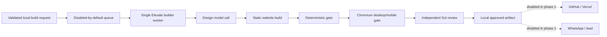

# Hermes Preview Builder Migration

**Status:** Draft for review
**Date:** 2026-08-23
**Source:** `/opt/synqora-builder` on `Synqora_Srikar`
**Destination:** `srikarhermes-vps`

## Context

The Synqora VPS already contains a queued website builder that turns a bounded
brief and optional reference assets into a static website. Its pipeline covers
design, generation, deterministic tests, browser screenshots, an independent
Sol visual review, private GitHub publication, and preview deployment.

The ElevateBox demo can eventually use that foundation to generate a polished
lead-specific e-commerce preview after a qualifying call. This first phase only
migrates and repairs the builder on the Srikar Hermes VPS. It does not connect
the builder to the voice agent, WhatsApp, GitHub, Vercel, or any lead.

The source cannot be copied and activated unchanged:

- its current test run reports 170 tests with 31 failures and 35 errors;
- its newer `pending_approval` state is not reflected consistently in tests;
- it contains a Synqora-specific preview hostname and Cloudflare publisher;
- its notification module contains an internal WhatsApp target;
- its service layout assumes a dedicated Codex installation and credentials;
- its production state contains jobs, audit data, caches, and generated sites
  that do not belong on the Hermes VPS.

The destination has Python 3.13, Node.js 22, npm, Chromium, Docker, 58 GB free
disk, and about 3.7 GB currently available memory. It has only two CPU cores,
so the migrated worker must process one website at a time with conservative
resource limits.

## Goals

1. Preserve the reusable builder source in a new private Git repository.
2. Remove runtime state, credentials, historical artifacts, and internal
   notification destinations from the migration.
3. Repair the current approval-workflow and test-suite drift.
4. Install the builder on the Hermes VPS under a dedicated service identity.
5. Verify design, build, deterministic gate, browser gate, and final-review
   behavior without publishing a preview or contacting a lead.
6. Leave every automatic trigger and external-delivery path disabled.
7. Produce a repeatable installation and rollback process.

## Non-Goals

- Voice-agent or callback integration.
- WhatsApp delivery, including test messages.
- Calling any phone number.
- Creating a Vercel project or deploying a public preview.
- Copying Cloudflare, GitHub, Codex, Hermes, or WhatsApp credentials.
- Copying source jobs, databases, logs, caches, previews, or audit history.
- Generating lead-specific imagery or adding the approval CTA.
- Renaming every internal Python module during the migration.
- Running more than one website build concurrently.

## Chosen Architecture

Create a private repository named `elevate-preview-builder` from a sanitized
source snapshot. Keep the existing `synqora_builder` Python import namespace in
this phase to reduce migration risk; the repository, filesystem paths, service
identity, and operational configuration use the new Elevate name.

The installed system remains independent of the current
`elevate-whatsapp-bridge` process:



The voice bridge does not import builder code and the builder cannot read the
bridge environment. Their future integration will use a narrow authenticated
job API covered by a separate design.

## Sanitized Source Snapshot

The repository includes:

- `src/`, `bin/`, `config/`, `scripts/`, `systemd/`, `tmpfiles/`, and `tests/`;
- `package.json`, `package-lock.json`, `pyproject.toml`, and `.gitignore`;
- a provenance file containing the source host alias, source path, UTC capture
  time, and SHA-256 digest of the sanitized tree;
- installation, operation, and recovery documentation.

The repository excludes:

- `.venv/`, `node_modules/`, `__pycache__/`, and `*.egg-info/`;
- macOS AppleDouble files named `._*`;
- `/var/lib/synqora-builder`, `/var/spool/synqora-builder`, caches, logs, and
  `/srv/synqora-mvp-builds`;
- every `.env`, token, credential, Codex home, deployment receipt, generated
  site, screenshot, and historic build request;
- source-machine system accounts and ownership metadata.

The snapshot is transferred through the local workspace, reviewed, and
committed before it is installed on Hermes. The live source directory is never
modified.

## Test Repair Contract

Repairs must preserve intentional production behavior rather than weakening
checks to satisfy stale assertions.

The canonical lifecycle is:

```text
pending_approval -> queued -> researching -> designing -> building
                 -> testing -> visual_review -> deploying -> ready
```

Required semantics:

- submission persists `pending_approval` and does not publish work to the
  worker queue;
- explicit approval durably transitions the job to `queued` and publishes it
  once;
- rejection and cancellation are terminal and idempotent;
- the worker cannot claim a pending or rejected job;
- file modes remain restrictive (`0750` directories and `0640` state files);
- skill routing is driven by `config/skills.json` and has deterministic order;
- Codex process tests validate descriptor-bound workspaces without assuming a
  particular human-readable descriptor path;
- all schemas remain fail-closed and reject unknown fields;
- unit and integration tests cannot invoke a real model, deploy a site, send a
  message, or place a call.

Every changed production behavior requires an explicit test. Existing tests
may be updated only when the specification makes their former expectation
obsolete.

## Destination Layout

Use dedicated paths instead of sharing the voice bridge directories:

```text
/opt/elevate-preview-builder          immutable application code
/etc/elevate-preview-builder          root-owned configuration
/var/lib/elevate-preview-builder      database, audit log, skills, model home
/var/cache/elevate-preview-builder    npm, browser, and bounded build caches
/var/spool/elevate-preview-builder    typed queue and handoff records
/srv/elevate-preview-builds           isolated per-job workspaces
/run/elevate-preview-builder          locks and ephemeral runtime state
```

Create a system account named `elevate-builder` with no interactive login. It
does not join the voice bridge group and cannot read
`/etc/elevate-whatsapp-bridge.env` or its persistent state.

Python dependencies are installed into an application-specific virtual
environment. Node dependencies use the committed lockfile with `npm ci`. The
Codex binary is installed at a pinned version into the builder-owned runtime.
A new builder-scoped authentication profile is provisioned separately; source
Codex credentials are never copied.

## Service Isolation

Install renamed systemd units for the worker, deploy handoff, notification
handoff, and cleanup timer. In this phase:

- queue, deploy, and notification path units remain disabled;
- deployment and notification services have no credentials or destinations;
- deployment and notification entry points fail closed unless
  `ELEVATE_EXTERNAL_DELIVERY=live`; phase one fixes it to `disabled`;
- worker concurrency is one;
- worker limits are `MemoryMax=2G` and `CPUQuota=150%`;
- browser-gate limits are included in the same service control group;
- `NoNewPrivileges`, `PrivateTmp`, strict filesystem protection, empty
  capability sets, and bounded writable paths remain enabled;
- a 10-minute phase-one job deadline replaces the source 30-minute deadline so
  a stuck build cannot consume the demo server indefinitely.

The service fails closed when model authentication, schema files, skill files,
Chromium, or required directories are unavailable.

## External Delivery Interlock

Phase one must make accidental delivery impossible through independent layers:

1. Request validation requires `lead_delivery: false`.
2. The deployment and notification systemd path units are disabled.
3. `ELEVATE_EXTERNAL_DELIVERY` is fixed to `disabled`, and both side-effecting
   entry points reject every other missing or invalid value.
4. No GitHub, Cloudflare, Vercel, or WhatsApp credentials are installed.
5. No external preview hostname is configured.
6. Verification uses a local artifact and loopback preview only.
7. The builder service account cannot read voice-bridge credentials.

An external publisher cannot be enabled by changing one flag. A later approved
design must add new credentials, a Vercel adapter, preview expiry, and the lead
delivery contract.

## Verification

Verification proceeds in increasing-risk order:

1. Reproduce the source failures and retain the summarized baseline.
2. Run the complete repaired Python test suite on a clean local checkout.
3. Run Node syntax and browser-gate self-tests.
4. Scan the repository for credential patterns and prohibited runtime files.
5. Install into a staging path on Hermes with all units disabled.
6. Re-run the complete test suite on Hermes.
7. Review effective systemd sandboxing and filesystem ownership.
8. Run an offline fixture through request validation, approval, queueing,
   deterministic gates, and cleanup.
9. Run one model-backed internal website build and validate its local,
   unconsumed deployment handoff while the deploy path remains disabled.
10. Serve its artifact on loopback only and capture desktop and mobile
    screenshots with Chromium.
11. Confirm no call, WhatsApp message, GitHub repository, Cloudflare deployment,
    Vercel deployment, public DNS entry, or public listener was created.

The model-backed check is successful only when it reaches a locally approved
artifact within ten minutes. The 2-5 minute lead-facing objective belongs to
the later optimization phase and is measured separately.

## Observability

Logs contain job identifiers, stages, durations, exit classes, and gate
summaries. They do not contain briefs, source content, generated page copy,
credentials, phone numbers, or complete model output.

The migration records:

- exact repository commit installed;
- Python, Node, Chromium, and Codex versions;
- test totals and duration;
- local build stage timings;
- artifact digest and screenshot paths;
- effective unit enablement state.

## Deployment Sequence

1. Capture and checksum the sanitized source snapshot.
2. Create the private `elevate-preview-builder` repository.
3. Commit the unmodified sanitized baseline.
4. Repair approval semantics and tests in the repository.
5. Run local verification and credential scanning.
6. Create destination directories and the `elevate-builder` account.
7. Install pinned Python, Node, Chromium, and Codex dependencies.
8. Install code and systemd units with all trigger units disabled.
9. Run destination tests, offline fixture verification, and sandbox review.
10. Provision fresh builder-scoped model authentication.
11. Run one internal no-delivery model-backed build.
12. Record the installation commit and verification evidence.

## Rollback

The migration does not modify existing voice or feedback services. Rollback:

1. stop and disable every `elevate-preview-builder*` unit;
2. archive non-sensitive verification evidence;
3. remove the application symlink or installation directory;
4. retain the private repository and audit record;
5. remove builder state only after confirming it contains no needed evidence.

No DNS, Vercel, GitHub publication, WhatsApp, or voice rollback is required in
this phase because those systems are not connected.

## Acceptance Criteria

- The source VPS remains unchanged and continues running its existing services.
- The private repository contains only the sanitized source and documented
  provenance.
- All Python tests and Node/browser self-tests pass locally and on Hermes.
- No copied credential or historic runtime artifact exists in the repository
  or destination installation.
- The builder runs as `elevate-builder` with one-job concurrency and the stated
  resource and filesystem restrictions.
- A local fixture completes request, approval, queue, gate, and cleanup flows.
- One internal model-backed build produces a nonblank desktop and mobile
  artifact plus a valid unconsumed handoff without any external delivery.
- All builder trigger units remain disabled after verification.
- Existing ElevateBox voice, callback, feedback, and WhatsApp services remain
  healthy and unchanged.
